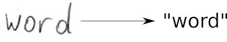
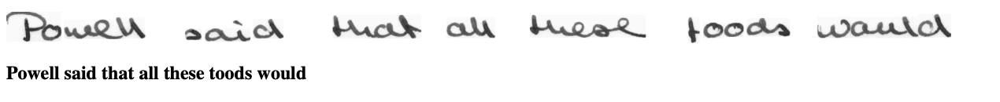
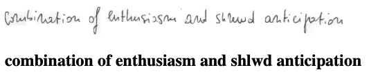

# Predect

Predect is a prescription detector web app that recognizes doctor's handwriting and tells what medicines and diagnosis doctor has concluded for a patient

It is implemented with TensorFlow (TF) and trained on the IAM off-line HTR dataset.
The model takes **images of single words or text lines (multiple words) as input** and **outputs the recognized text**.
3/4 of the words from the validation-set are correctly recognized, and the character error rate is around 10%.




## Run demo

* Run inference code:
  * Execute `python app.py` to run the webapp
```
> python app.py
WARNING: This is a development server. Do not use it in a production deployment. Use a production WSGI server instead.
 * Serving Flask app 'app'
 * Debug mode: on
 * Running on http://127.0.0.1:5000 (Press CTRL+C to quit)
 * Restarting with stat
 * Debugger is active!
 * Debugger PIN: 114-156-206
```
select the input images, and the expected outputs are shown below 



